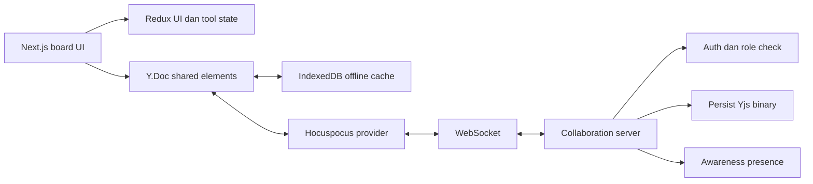

# Rencana Collaboration Realtime OpenBoard

Status: usulan fitur setelah MVP

MVP OpenBoard sudah selesai sebagai aplikasi local-first dan sudah dideploy. Dokumen ini menetapkan kontrak produk, arsitektur, model akses, tahapan delivery, dan keputusan teknis untuk fitur beberapa pengguna yang bekerja pada board yang sama.

## Tujuan

Pengguna dapat:

- membuat board milik sendiri;
- mengundang pengguna lain ke board;
- memilih apakah pengguna lain dapat melihat atau mengedit board;
- membuka board yang sama dari beberapa perangkat secara realtime;
- tetap bekerja ketika koneksi terputus dan menyinkronkan perubahan setelah tersambung kembali;
- melihat siapa yang sedang berada di board tanpa menjadikan data presence sebagai isi board.

Kolaborasi harus tetap terasa aman bagi pemilik board. Board baru bersifat privat, akses dapat dicabut, dan setiap koneksi harus diverifikasi oleh server.

## Kontrak akses produk

### Peran

| Peran | Melihat board | Mengedit elemen | Mengelola akses | Menghapus board |
| --- | --- | --- | --- | --- |
| Owner | Ya | Ya | Ya | Ya |
| Editor | Ya | Ya | Tidak | Tidak |
| Viewer | Ya | Tidak | Tidak | Tidak |

Peran `commenter` dapat ditambahkan setelah alur komentar benar-benar dibutuhkan. Jangan menambahkannya pada MVP collaboration karena komentar memerlukan model data, notifikasi, dan aturan moderasi tersendiri.

### Aturan default

- Board baru bersifat `private`.
- Owner selalu memiliki akses penuh dan tidak dapat menghapus dirinya sendiri dari board.
- Editor tidak dapat mengubah peran anggota lain atau membagikan ulang board.
- Viewer menerima mode read-only, termasuk menonaktifkan tool yang mengubah isi board.
- Link akses tidak otomatis memberikan hak edit.
- Akses yang dicabut berlaku untuk koneksi baru dan koneksi realtime yang sedang aktif.

## Pengalaman berbagi board

Tombol `Share` membuka modal yang menampilkan anggota saat ini dan akses umum. Pengguna tidak perlu memahami detail WebSocket atau sinkronisasi untuk membagikan board.

Contoh struktur modal:

```text
Share board

People with access
- Owner name                 Owner
- collaborator@example.com  Editor       [Change] [Remove]

General access
- Restricted
- Anyone with the link       Viewer

[Copy link]
```

Alur yang disarankan:

1. Owner memasukkan email atau username pengguna, memilih peran, lalu mengirim undangan.
2. Sistem membuat undangan berumur terbatas dan penerima melihat board setelah login.
3. Owner dapat mengubah peran, mencabut akses, atau mencabut semua link aktif.
4. Owner dapat mengaktifkan akses berbasis link. Pilihan defaultnya adalah `Viewer`.
5. Aksi `Copy link` memberi umpan balik yang jelas dan tidak membocorkan token mentah ke log aplikasi.

### Kebijakan link

`boardId` adalah identifier, bukan secret. Siapa pun yang mengetahui ID tetap harus melewati pemeriksaan akses server.

Setiap invite atau share link harus menggunakan token acak dengan entropi tinggi. Database menyimpan hash token, bukan token mentah. Link perlu memiliki tanggal kedaluwarsa dan dapat dicabut oleh owner. Jika link memberikan hak edit, pengguna tetap harus login agar perubahan dapat diaudit dan aksesnya dapat dicabut per akun.

Kebijakan awal yang direkomendasikan:

- link publik default: `Viewer`;
- link `Editor`: hanya setelah owner mengaktifkannya secara eksplisit;
- akses publik dapat dimatikan kapan saja;
- link yang kedaluwarsa atau dicabut menampilkan halaman akses ditolak yang dapat dipahami pengguna;
- undangan akun tertentu lebih diutamakan untuk penggunaan tim karena dapat diaudit per pengguna.

## Arsitektur yang direkomendasikan

Yjs cocok sebagai model data bersama karena menyediakan CRDT, shared types, dan tidak mengikat aplikasi pada satu transport. Awareness Yjs digunakan untuk cursor, selection, dan presence yang sifatnya sementara. Hocuspocus direkomendasikan sebagai server WebSocket yang menangani autentikasi, sinkronisasi, dan persistence.



### Kepemilikan state

| State | Sumber kebenaran | Catatan |
| --- | --- | --- |
| Tool aktif, panel, modal, zoom lokal | Redux | Tidak perlu disinkronkan ke pengguna lain |
| Elemen board, posisi, ukuran, style, z-index | `Y.Doc` | Semua perubahan kolaboratif masuk ke model ini |
| Cache offline dan status sinkronisasi lokal | IndexedDB | Cache dapat dibangun ulang dari server |
| Dokumen bersama di server | Yjs binary atau update binary | Simpan format Yjs, jangan membuat ulang dokumen dari JSON pada setiap write |
| Cursor, selection, user online | Yjs Awareness | Ephemeral dan tidak menjadi isi board |
| Undo dan redo kolaboratif | `Y.UndoManager` | Scope per pengguna atau per sesi sesuai UX yang dipilih |

Redux tetap dapat menjadi projection untuk kebutuhan UI, tetapi Redux history yang sekarang bersifat lokal tidak boleh dipakai sebagai sumber konflik antar pengguna. Event perubahan juga perlu dibedakan antara perubahan lokal, remote, dan hydration agar autosave lama tidak mengirim data ganda.

### Pilihan platform

Pilihan utama adalah Yjs + Hocuspocus yang di-host sendiri. Pilihan ini memberi kontrol atas persistence, authorization, dan deployment, sekaligus menjaga model data tetap portable.

Liveblocks dapat dipakai sebagai alternatif managed service jika kecepatan delivery lebih penting daripada kontrol infrastruktur. Keputusan ini memengaruhi biaya operasional, model autentikasi, observability, dan kemungkinan migrasi sehingga harus ditetapkan sebelum fase realtime edit dimulai.

Supabase Realtime berguna untuk presence dan broadcast sederhana. Ia tidak menggantikan model CRDT untuk menyelesaikan konflik pada isi board. Jika dipakai, gunakan untuk event pendukung dan tetap pilih sumber kebenaran yang jelas untuk dokumen board.

## Model backend minimum

Implementasi pertama memerlukan entitas berikut:

| Entitas | Field minimum | Tujuan |
| --- | --- | --- |
| `users` | `id`, `email`, `display_name`, `created_at` | Identitas akun |
| `boards` | `id`, `owner_id`, `title`, `visibility`, `created_at`, `updated_at` | Metadata dan owner |
| `board_members` | `board_id`, `user_id`, `role`, `status`, `created_at`, `updated_at` | Akses akun tertentu |
| `board_invites` | `board_id`, `invited_by`, `email_or_user_id`, `role`, `token_hash`, `expires_at`, `accepted_at`, `revoked_at` | Undangan yang dapat diaudit |
| `board_share_links` | `board_id`, `created_by`, `role`, `token_hash`, `expires_at`, `revoked_at` | Akses melalui link |
| `board_documents` | `board_id`, `ystate_binary`, `version`, `updated_at` | Persistence dokumen Yjs |

Constraint minimum:

- pasangan `board_id` dan `user_id` pada `board_members` unik;
- hanya satu owner aktif per board;
- role dan status harus berupa nilai enum yang tervalidasi server;
- invite dan share link yang sudah direvoke tidak boleh diterima lagi;
- semua query dan endpoint board memeriksa membership atau link grant di server.

## Migrasi dari board local-first

Board yang saat ini hanya ada di perangkat pengguna tidak boleh diam-diam diunggah ketika fitur collaboration dirilis. Alur migrasi yang aman:

1. Pengguna login atau menautkan board lokal ke akun.
2. Aplikasi menampilkan pilihan `Upload local board` dengan ukuran dan waktu perubahan terakhir.
3. Setelah pengguna menyetujui, server membuat board remote dan menanamkan isi lokal sebagai dokumen Yjs awal.
4. Aplikasi menyimpan `remoteBoardId` dan status sync di IndexedDB.
5. Jika board remote sudah memiliki perubahan, aplikasi meminta pengguna memilih board remote, board lokal, atau proses merge yang didukung.
6. Board yang tidak ditautkan tetap dapat digunakan sebagai board lokal.

Migrasi harus idempotent. Retry setelah jaringan putus tidak boleh membuat dua board remote untuk satu proses migrasi.

## Tahapan delivery

### Fase 1: identitas dan owner

- Tambahkan login dan sesi yang dapat diverifikasi server.
- Buat board remote milik owner.
- Tampilkan daftar board milik pengguna.
- Pertahankan mode local-only untuk board lama.

### Fase 2: akses dan sharing

- Implementasikan `Owner`, `Editor`, dan `Viewer`.
- Tambahkan share modal, invite akun, link viewer, perubahan role, revoke, dan expiry.
- Tambahkan halaman akses ditolak dan status loading/error yang jelas.

### Fase 3: persistence remote dan read-only collaboration

- Simpan dokumen Yjs sebagai binary.
- Buka board remote sebagai viewer dari dua sesi berbeda.
- Validasi authorization pada HTTP dan WebSocket.
- Tambahkan observability untuk connect, disconnect, sync, reject, dan persistence failure.

### Fase 4: realtime editing

- Sinkronkan create, update, delete, move, resize, style, dan z-index melalui Yjs.
- Tambahkan reconnect, offline queue, dan conflict test.
- Ganti undo/redo lokal dengan `Y.UndoManager` untuk perubahan bersama.
- Pastikan autosave status mencakup cache lokal dan persistence remote.

### Fase 5: presence dan hardening

- Tampilkan avatar atau nama pengguna yang sedang aktif.
- Tambahkan cursor atau selection jika terbukti membantu.
- Tambahkan rate limit, batas ukuran dokumen, monitoring, dan prosedur revoke darurat.
- Uji dengan beberapa tab, beberapa perangkat, koneksi lambat, refresh saat offline, dan tab yang crash.

## Acceptance criteria

- Board baru default-nya privat.
- Owner dapat mengundang satu pengguna sebagai editor dan satu pengguna sebagai viewer.
- Viewer tidak dapat mengubah board melalui UI maupun request langsung.
- Owner dapat mengubah role dan mencabut akses tanpa menghapus board.
- Dua sesi editor melihat perubahan elemen tanpa reload.
- Perubahan offline tersimpan lokal dan tersinkronkan setelah reconnect tanpa duplikasi.
- Konflik pada elemen yang sama tidak menghapus perubahan pengguna lain secara acak.
- Cursor dan presence yang hilang setelah disconnect tidak tersimpan sebagai data board.
- Revoke memutus koneksi realtime yang aktif dalam batas waktu yang disepakati.
- Undangan kadaluarsa, token invalid, dan persistence failure memiliki feedback yang jelas.
- Tidak ada raw invite token di database, log aplikasi, atau analytics event.

## Keputusan yang masih perlu ditetapkan

- Provider autentikasi dan cara menghubungkan identitas dengan `users`.
- Hocuspocus self-host atau layanan managed seperti Liveblocks.
- Database metadata dan storage untuk Yjs binary.
- Apakah link editor boleh tanpa akun pada tahap lanjutan.
- Batas jumlah collaborator, ukuran board, dan jumlah operasi per menit.
- Apakah board dapat dipublikasikan sebagai viewer tanpa login.
- Apakah komentar, mention, dan notifikasi masuk collaboration atau menjadi fitur terpisah.
- Apakah perubahan role atau revoke harus tercatat dalam audit log yang terlihat owner.
- Aturan merge ketika board lokal dan remote sama-sama berubah sebelum migrasi.

## Keamanan dan operasional

- Jangan mempercayai `boardId`, role, atau user ID dari client.
- Lakukan authorization ulang pada setiap endpoint board dan saat handshake WebSocket.
- Gunakan cookie sesi yang aman atau token akses berumur pendek dengan refresh yang dapat dicabut.
- Simpan hanya hash invite token dan share token.
- Batasi ukuran dokumen, ukuran update, jumlah koneksi, dan frekuensi operasi.
- Terapkan rate limit pada pembuatan invite, percobaan menerima invite, dan endpoint share.
- Hindari memasukkan isi board atau token ke log.
- Sediakan revoke untuk member, invite, dan share link.
- Backup persistence Yjs dan siapkan recovery untuk dokumen yang korup.
- Pantau latency sync, reconnect rate, rejected authorization, persistence error, dan ukuran dokumen.

## Referensi teknis

- [Yjs documentation](https://docs.yjs.dev/) untuk CRDT, shared types, provider, dan persistence.
- [Yjs Awareness](https://docs.yjs.dev/getting-started/adding-awareness) untuk presence dan cursor yang bersifat ephemeral.
- [Hocuspocus overview](https://tiptap.dev/docs/hocuspocus/getting-started/overview) untuk server realtime berbasis Yjs.
- [Hocuspocus authentication](https://tiptap.dev/docs/hocuspocus/guides/authentication) untuk pemeriksaan akses pada koneksi.
- [Hocuspocus persistence](https://tiptap.dev/docs/hocuspocus/guides/persistence) untuk menyimpan update Yjs sebagai binary.
- [Liveblocks authentication](https://liveblocks.io/docs/api-reference/authentication) sebagai alternatif managed service.
- [Supabase Presence](https://supabase.com/docs/guides/realtime/presence) untuk presence dan broadcast pendukung.
